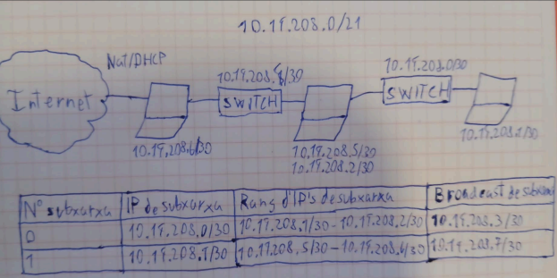
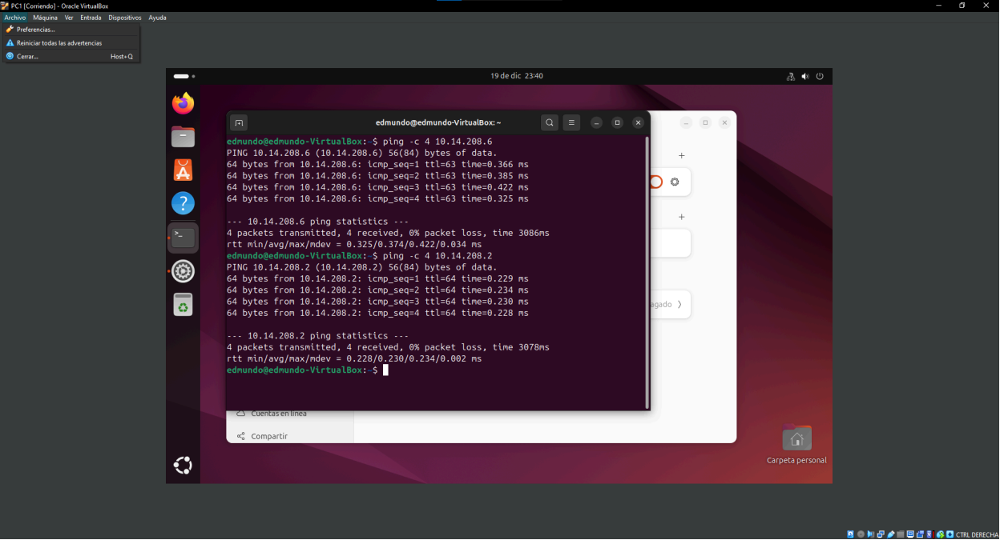
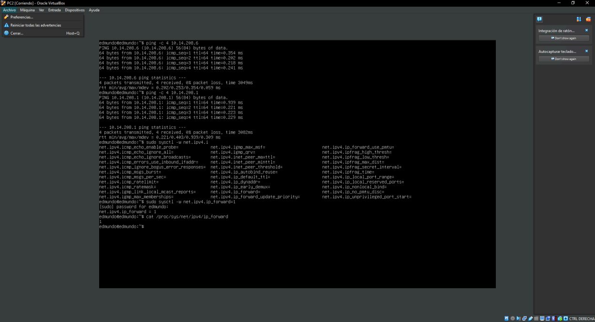
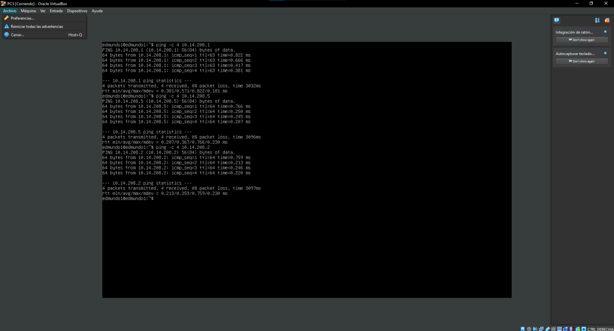

# Escenario-Ecommerce-Edmundo
## Objectiu

Implementar una infraestructura virtualitzada formada per tres màquines Ubuntu amb routing entre xarxes internes.

## Subnetting

Xarxa reservada: 10.14.208.0/21

### Xarxa 1

10.14.208.0/29

### Xarxa 2

10.14.208.8/29

## Assignació IP
### PC1

10.14.208.2/29 Gateway: 10.14.208.1

### PC2
red1: 10.14.208.1/29
red2: 10.14.208.9/29
### PC3
red2: 10.14.208.10/29
NAT: Internet
gateway intern: 10.14.208.9
## Dibuix lògic

## Comprovacions
### Comprovació PC1

### Comprovació PC2

### Comprovació PC3

## IP Forwarding
### Activació temporal

sudo sysctl -w net.ipv4.ip_forward=1

### Comprovació

cat /proc/sys/net/ipv4/ip_forward

## Traceroute

El recorregut correcte és:

PC1 → PC2 → PC3

Destí correcte:

10.14.208.10
